# Kubernetes Infrastructure as Code (IaC)

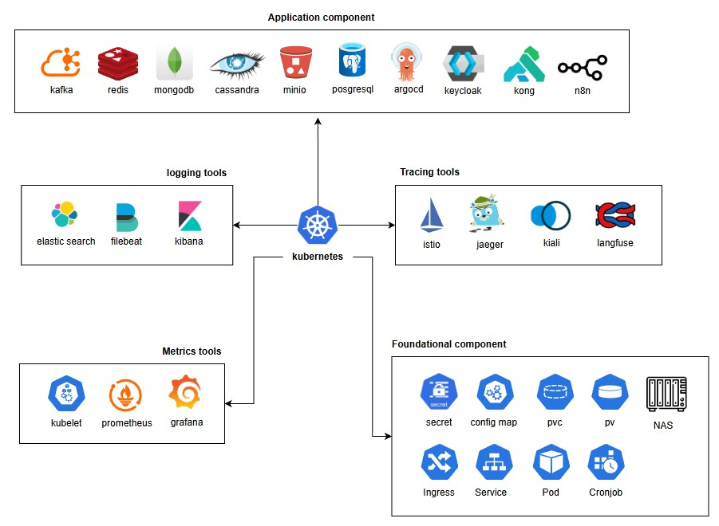

This repository provides a comprehensive set of examples for setting up a Kubernetes environment using an Infrastructure as Code (IaC) approach. Whether you are a beginner or an experienced developer, you can find the various configuration files needed to deploy and manage modern applications here.  
[Live Demo for Dashboard](https://dashboard.mydormroom.dpdns.org/)  
[Live Demo for Matrics](https://grafana.mydormroom.dpdns.org/)  
[Live Demo for Logging](https://kibana.mydormroom.dpdns.org/)  
[Live Demo for Service Tracing](https://kiali.mydormroom.dpdns.org/)  
[Live Demo for LLM Tracing](https://langfuse.mydormroom.dpdns.org/)  
[Live Demo for Postgresql](https://adminer.mydormroom.dpdns.org/)  
[Live Demo for Minio](https://minio.mydormroom.dpdns.org/)  
[Live Demo for Argocd](https://argocd.mydormroom.dpdns.org/)  
[Live Demo for Redis](https://redis-commander.mydormroom.dpdns.org/)  
[Live Demo for Kafka](https://kafka-ui.mydormroom.dpdns.org/)  
[Live Demo for Cassandra](https://cassandra-web.mydormroom.dpdns.org/)  
[Live Demo for Mongo](https://mongo-express.mydormroom.dpdns.org/)  
[Live Demo for Kong](https://konga.mydormroom.dpdns.org/)  
[Live Demo for Keycloak](https://keycloak.mydormroom.dpdns.org/)  
[Live Demo for N8N](https://n8n.mydormroom.dpdns.org/)  

## Foundational Components

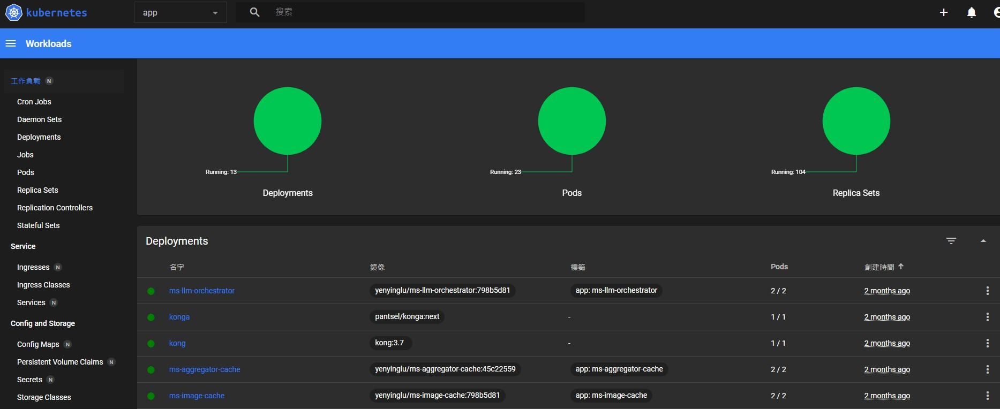

```bash
kubectl -n kubernetes-dashboard create token admin --duration=8760h
```

This repository covers the foundational components of a Kubernetes environment. It includes key resources such as Pods, CronJobs, Secrets, ConfigMaps, PersistentVolumes (PV), PersistentVolumeClaims (PVC), Services, and Ingresses, which form the building blocks for deploying applications, managing configuration, handling storage, and exposing services within a cluster.

## Service Distributed Tracing

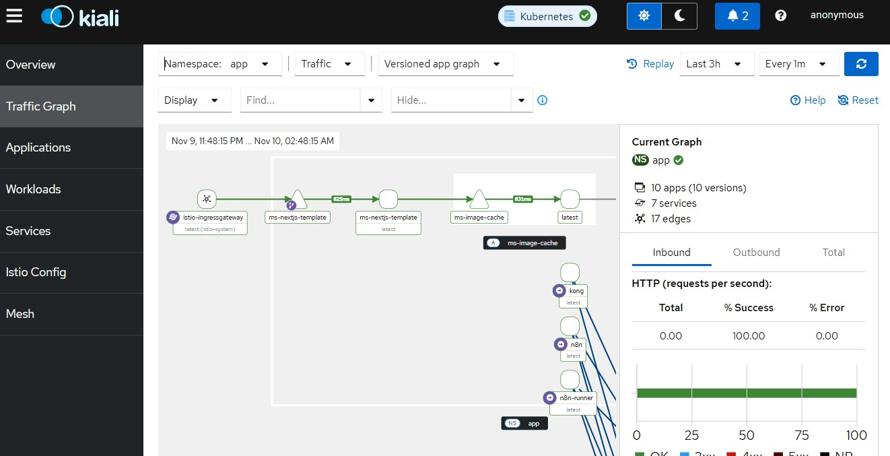

In a microservices architecture, tracing the full path of a request is essential for understanding system behavior and debugging.

- **Istio**: A service mesh platform that provides traffic management, security, and observability.
- **Jaeger**: An open-source, end-to-end distributed tracing system for monitoring and troubleshooting complex microservices-based systems.
- **Kiali**: A visualization tool for service meshes, capable of displaying service topology, monitoring traffic, and analyzing trace data.

## LLM Distributed Tracing

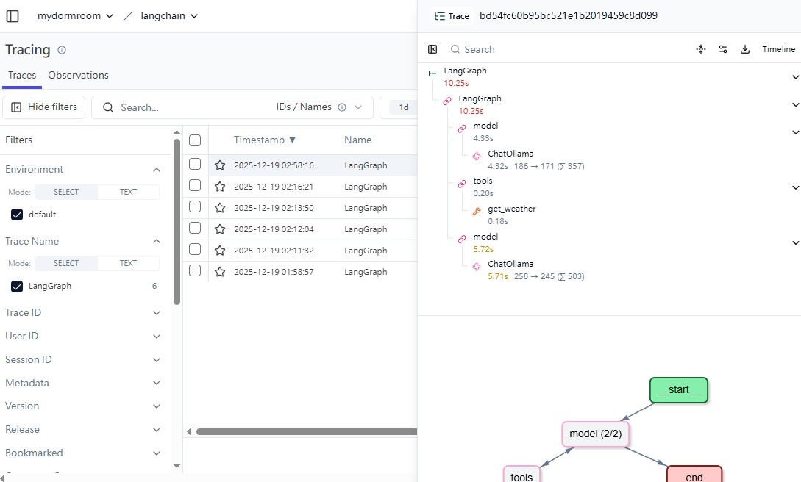

LLM Distributed Tracing tracks the entire reasoning chain across microservices, capturing not only service latency but also prompts, it ensure AI transparency and cost control.

- **Langfuse**: An open-source observability and analytics platform specifically designed for LLM applications.

## Metrics & Monitoring

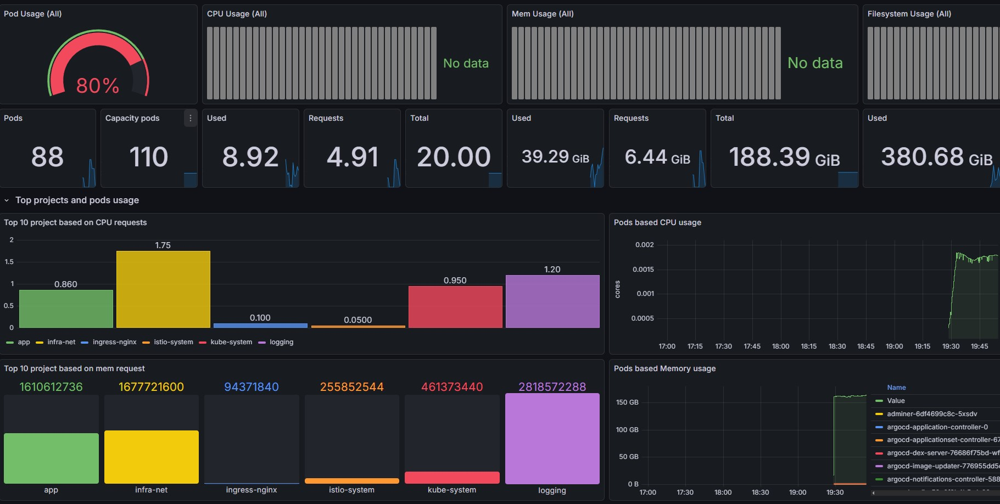

To ensure system stability and performance, this project integrates a powerful monitoring stack.

- **Kubelet**: An agent built into each node that provides basic monitoring metrics at the node and container level.
- **Prometheus**: An open-source monitoring and alerting toolkit used to collect and store time-series metrics data.
- **Grafana**: A powerful visualization platform that can transform metrics data collected by Prometheus into easy-to-understand dashboards.

## Logging

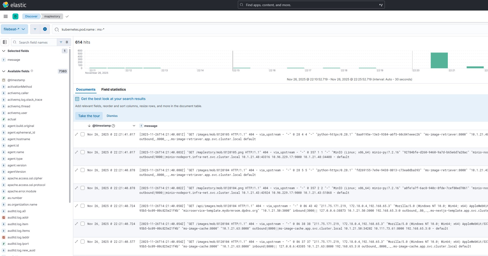

```bash
kubectl get secret es-es-elastic-user -n logging -o go-template='{{.data.elastic | base64decode}}'
```

Centralized log management is crucial for troubleshooting and behavior analysis. We adopt the widely-used ELK Stack.

- **Elasticsearch**: A distributed search and analytics engine for storing and indexing all logs.
- **Filebeat**: A lightweight log shipper designed to collect logs from servers, containers, and Kubernetes workloads, and forward them to Elasticsearch or Logstash for centralized logging and analysis.
- **Kibana**: A log visualization and query tool that allows users to easily explore log data in Elasticsearch.

## Deployed Application

This repository also includes deployment examples for several common applications, which you can use directly or as a reference for your own applications.

### **PostgreSQL**
A powerful and reliable open-source object-relational database system.

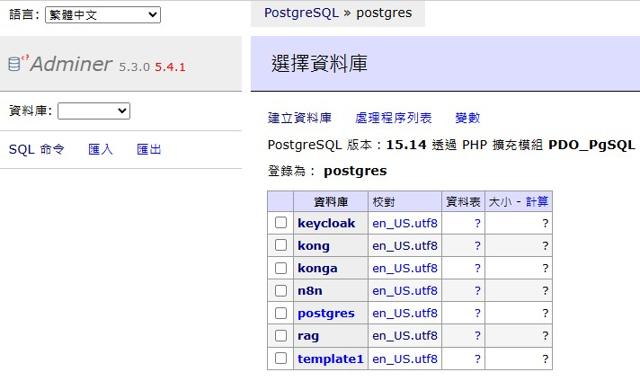

### **MinIO**
A high-performance, S3-compatible object storage service.

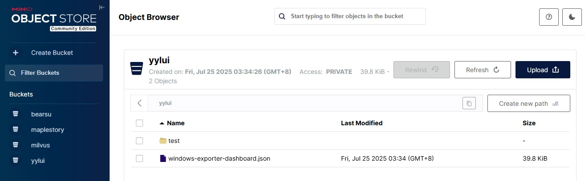

### **ArgoCD**
A declarative, GitOps continuous delivery tool.

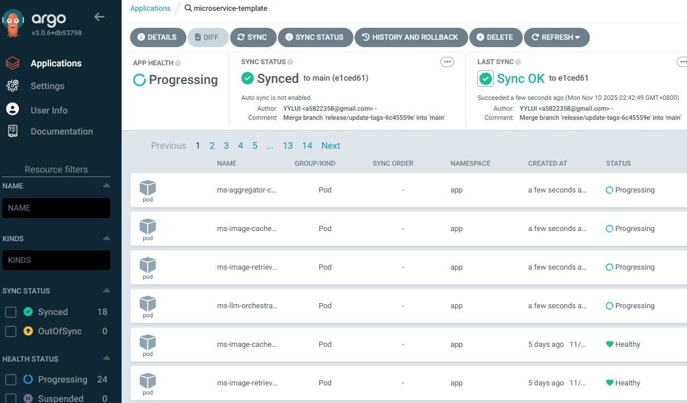

### **Kafka**
A distributed streaming platform for building real-time data pipelines and streaming apps.

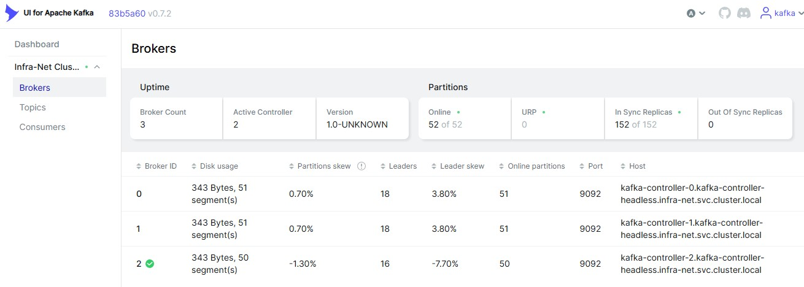

### **Redis**
A high-performance in-memory data structure store, used as a database, cache, and message broker.

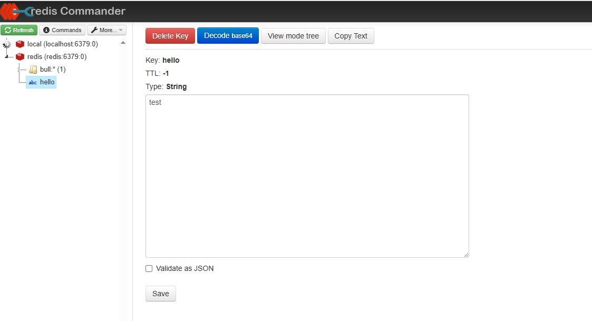

### **MongoDB**
A document-based NoSQL database suitable for applications requiring high scalability and flexibility.

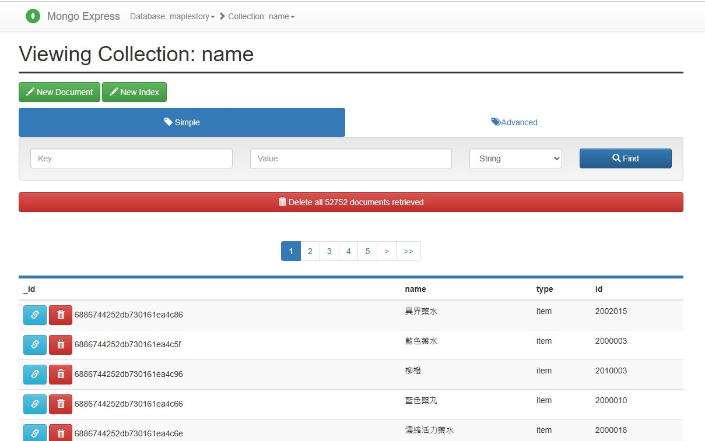

### **Cassandra**
A highly scalable and distributed NoSQL database designed for handling large amounts of data across many commodity servers with no single point of failure. It supports high availability, linear scalability, and a flexible schema, making it suitable for real-time big data applications.

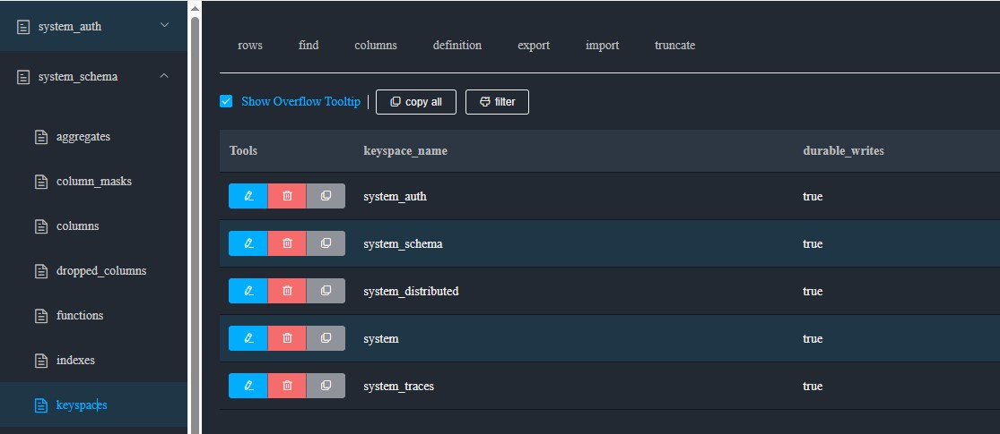

### **Kong**
An open-source API gateway and microservice management layer that provides features such as load balancing, authentication, rate limiting, and logging. It helps manage, secure, and monitor API traffic efficiently.

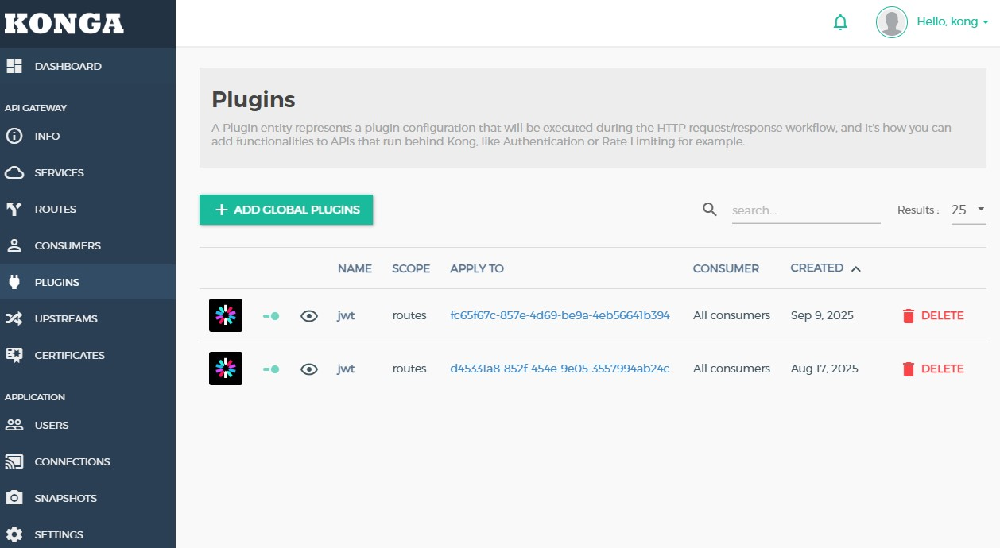

### **Keycloak**
An open-source identity and access management solution that supports Single Sign-On (SSO), OAuth2, OpenID Connect, and SAML. It allows secure user authentication and centralized authorization across multiple services.

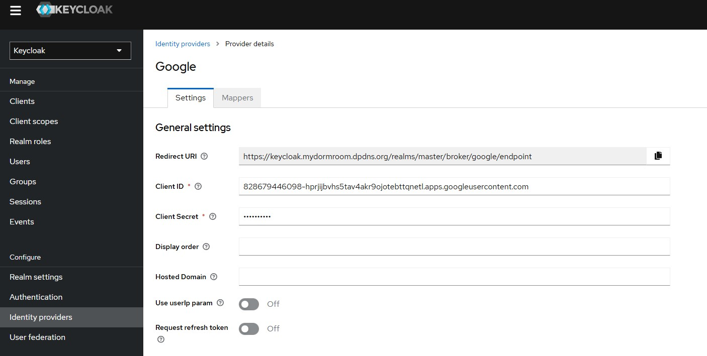


