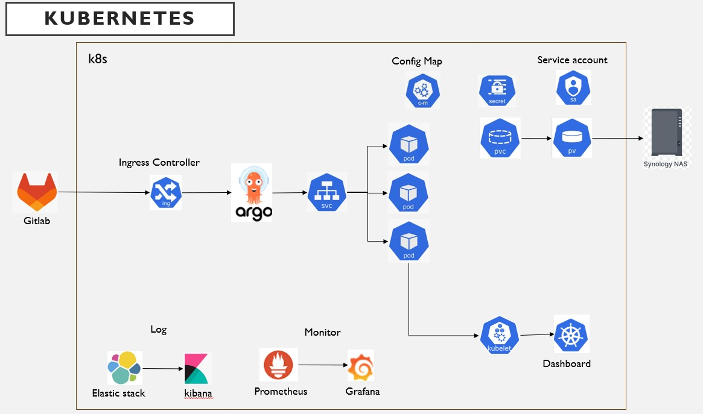

# Kubernetes Infrastructure as Code (IaC)



This repository provides a comprehensive set of examples for setting up a Kubernetes environment using an Infrastructure as Code (IaC) approach. Whether you are a beginner or an experienced developer, you can find the various configuration files needed to deploy and manage modern applications here.

## Foundational Components


```bash
kubectl -n kubernetes-dashboard create token admin --duration=8760h
```

This repository covers the foundational components of a Kubernetes environment. It includes key resources such as Pods, CronJobs, Secrets, ConfigMaps, PersistentVolumes (PV), PersistentVolumeClaims (PVC), Services, and Ingresses, which form the building blocks for deploying applications, managing configuration, handling storage, and exposing services within a cluster.

## Distributed Tracing


In a microservices architecture, tracing the full path of a request is essential for understanding system behavior and debugging.

- **Istio**: A service mesh platform that provides traffic management, security, and observability.
- **Jaeger**: An open-source, end-to-end distributed tracing system for monitoring and troubleshooting complex microservices-based systems.
- **Kiali**: A visualization tool for service meshes, capable of displaying service topology, monitoring traffic, and analyzing trace data.

## Metrics & Monitoring

To ensure system stability and performance, this project integrates a powerful monitoring stack.

- **Kubelet**: An agent built into each node that provides basic monitoring metrics at the node and container level.
- **Prometheus**: An open-source monitoring and alerting toolkit used to collect and store time-series metrics data.
- **Grafana**: A powerful visualization platform that can transform metrics data collected by Prometheus into easy-to-understand dashboards.

## Logging

Centralized log management is crucial for troubleshooting and behavior analysis. We adopt the widely-used ELK Stack.

- **Elasticsearch**: A distributed search and analytics engine for storing and indexing all logs.
- **Logstash**: A server-side data processing pipeline that can dynamically collect data from various sources, transform it, and send it to Elasticsearch.
- **Kibana**: A log visualization and query tool that allows users to easily explore log data in Elasticsearch.

## Deployed Application

This repository also includes deployment examples for several common applications, which you can use directly or as a reference for your own applications.

### **PostgreSQL**
A powerful and reliable open-source object-relational database system.


### **MinIO**
A high-performance, S3-compatible object storage service.


### **ArgoCD**
A declarative, GitOps continuous delivery tool.


### **Kafka**
A distributed streaming platform for building real-time data pipelines and streaming apps.


### **Redis**
A high-performance in-memory data structure store, used as a database, cache, and message broker.


### **MongoDB**
A document-based NoSQL database suitable for applications requiring high scalability and flexibility.

